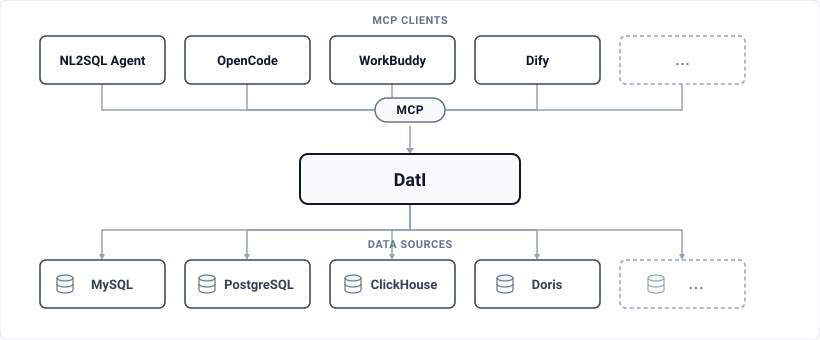

# DatI - AI 数据接入平台

DatI（Data Intelligence）是一个为 AI 大模型提供**统一数据接入能力**的基础设施平台。主要功能：

- **数据源接入**：支持主流数据库（MySQL、PostgreSQL、ClickHouse、Doris 等）
- **语义建模**：对表、列、列值、业务术语进行统一管理与检索
- **构建 MCP 服务**：预置元数据检索、SQL 执行等标准工具，支持参数化 SQL 查询，可自动生成符合 [MCP](https://modelcontextprotocol.io/) 标准的服务接口

  

## 适用场景

- **智能问数**：接入业务数据库，通过业务元数据配置以及通用预置工具即可支持 NL2SQL 分析工作流
- **轻应用搭建**：将数据库封装为 MCP 服务，Agent 通过对话即可直接对业务数据增删改查，快速构建轻量级应用

## 技术栈

- **后端**：Spring Boot 3.5.x + Java 21 + JPA
- **前端**：Vue 3 + TypeScript + Vite + Element Plus + TailwindCSS 4
- **数据库**：H2（开发）/ MySQL / PostgreSQL（生产）
- **搜索引擎**：Elasticsearch（语义检索）

## 文档导航

- [本地开发指南](docs/development.md)：环境准备、启动、常用命令与开发约定
- **架构与设计**（长期维护，与代码同步）：
  - [架构总览](docs/architecture/overview.md)
  - [认证架构](docs/architecture/authentication.md)
  - [授权架构](docs/architecture/permission.md)
  - [数据源模块](docs/architecture/datasource.md)
  - [语义管理模块](docs/architecture/semantic.md)
  - [MCP 服务管理](docs/architecture/mcp-service-management.md)
  - [模板引擎](docs/architecture/template-engine.md)
  - [编辑器架构](docs/architecture/editor.md)
- **用户帮助中心**：[docs/user-guide](docs/user-guide/index.md)（VitePress 站点，中英双语）
- **API 契约**：[docs/api/openapi.json](docs/api/openapi.json)（E2E 测试工具链使用）
- **AI 编码助手规范**：[AGENTS.md](AGENTS.md) 与 [.agents/rules/](.agents/rules/)（后端/前端/设计系统规范）
