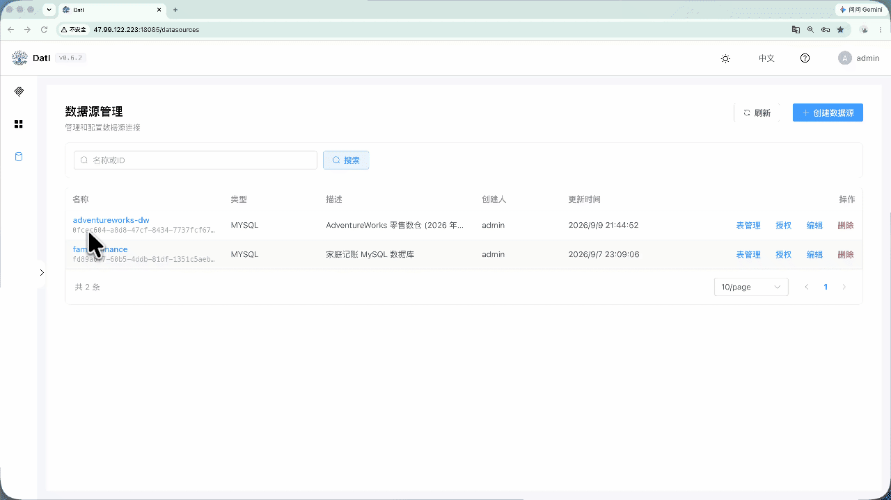
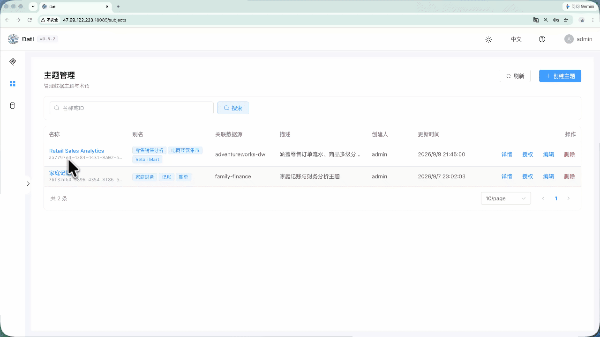
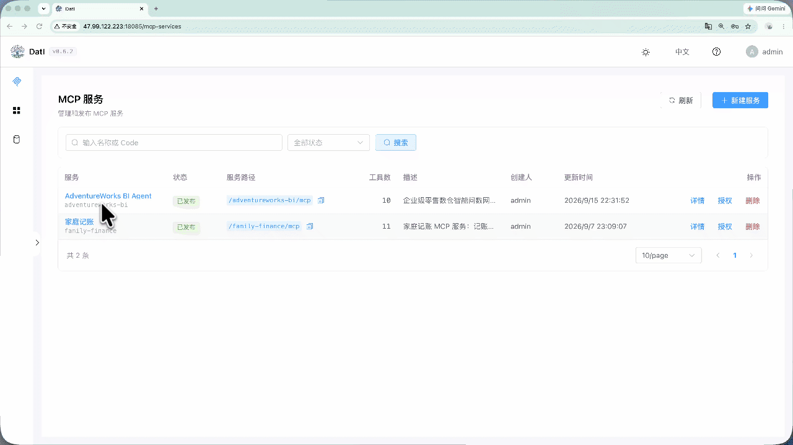
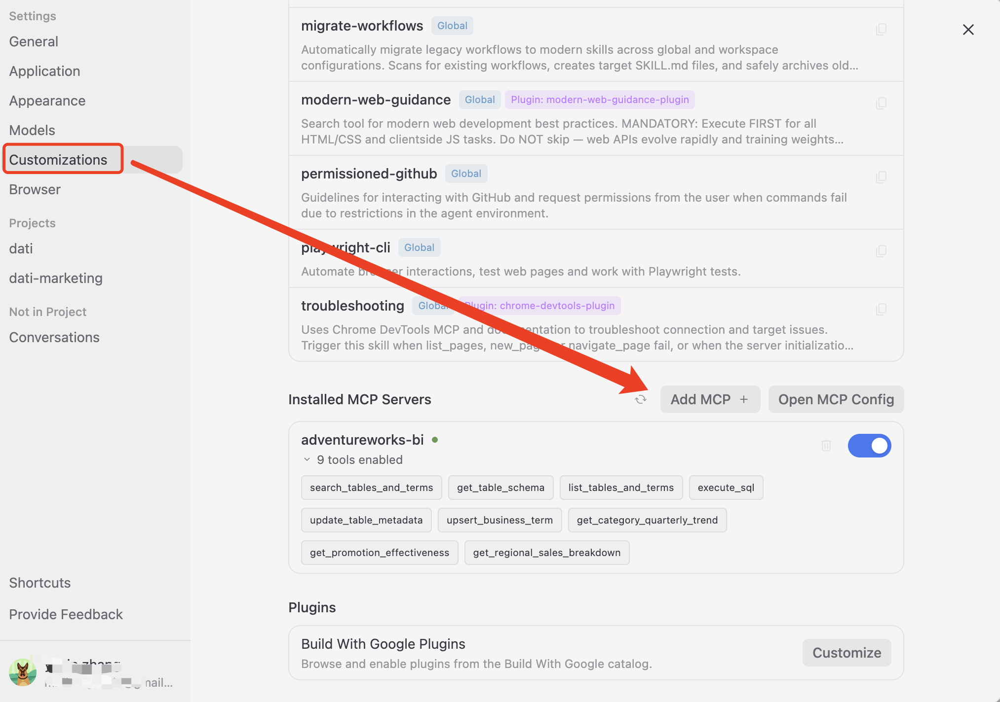
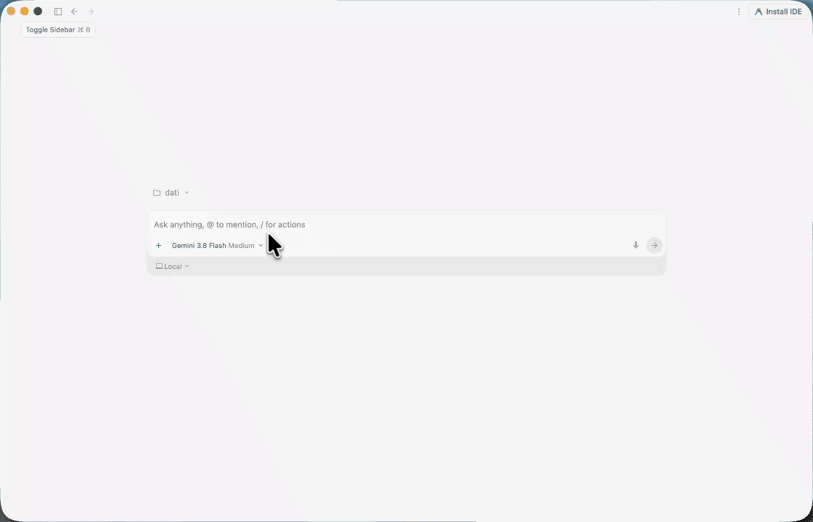

# DatI - Agent 数据库语义网关

[English](README.md) | [简体中文](README_zh.md)

DatI(Data Intelligence) 是连接 **AI Agent 与企业数据库** 的轻量级语义网关 —— 仅需接入数据库、配置语义信息、按需启用预置工具与参数化 SQL 工具，即可发布 MCP 服务，灵活地接入用户的 Agent 或任意 MCP Host

```text
┌────────────────────┐  ┌────────────────────┐  ┌────────────────────┐
│  User A: OpenCode  │  │  User B: WorkBuddy │  │  User N: DataAgent │
└──────────┬─────────┘  └──────────┬─────────┘  └──────────┬─────────┘
           └───────────────────────┼───────────────────────┘
                                   │ MCP (Streamable HTTP)
                                   ▼
┌─────────────────────────────── DatI ───────────────────────────────┐
│     ┌──────────────┐     ┌──────────────┐     ┌──────────────┐     │
│     │   Semantic   │     │   Security   │     │    Tools     │     │
│     └──────────────┘     └──────────────┘     └──────────────┘     │
└──────────────────────────────────┬─────────────────────────────────┘
                                   │
                                   ▼
┌────────────────────────────────────────────────────────────────────┐
│    MySQL     │   PostgreSQL    │    ClickHouse    │      Doris     │
└────────────────────────────────────────────────────────────────────┘
```

## 在线试用

体验地址：http://47.99.122.223:18085/

账号 / 密码：`demo` / `demo123`

内置示例数据仅供体验，环境会定期重置。

### Demo

数据与配置参考 [AdventureWorks 样例](examples/adventureworks-dw)，可使用 [dati-ops skill](skills/dati-ops) 自动化配置。

#### 1. 数据源元数据配置（表、列、列值可配置）

<details>
<summary><b>查看操作演示 (GIF)</b></summary>



</details>

#### 2. 主题配置（圈定表范围，配置业务术语）

<details>
<summary><b>查看操作演示 (GIF)</b></summary>



</details>

#### 3. MCP 配置（选定主题，开启预置工具，增加参数化 SQL 工具）

<details>
<summary><b>查看操作演示 (GIF)</b></summary>



</details>

#### 4. 配置 Agent 的 MCP（以 Antigravity 为例）

<details>
<summary><b>查看配置截图</b></summary>



</details>

#### 5. Agent 中问数

<details>
<summary><b>查看效果演示 (GIF)</b></summary>



</details>


## 快速开始

```bash
git clone https://github.com/yimindev/dati.git && cd dati
cp .env.example .env                # 需配置 JWT_SECRET 与 ES 密码
docker compose up -d --build
```

访问 `http://localhost:8085`，首个注册用户填写 `admin` 即自动成为超级管理员。详细配置与生产部署见 [部署手册](docs/deployment_zh.md)。


## 为什么选择 DatI？

1. **多数据库**：支持 MySQL、PostgreSQL、ClickHouse、Doris 等多种关系型与分析型数据库
2. **语义增强**：支持业务术语、字段别名与枚举字典值自动抽取，结合语义检索，让模型能够理解业务黑话、快速找对表
3. **灵活集成**：基于标准 [MCP](https://modelcontextprotocol.io/) 协议（Streamable HTTP），灵活集成至用户现有 Agent 或工作流
4. **高效构建**：提供开箱即用的预置工具（元数据探查、SQL 执行）与参数化 SQL 工具，免部署发布 MCP 服务
5. **安全管控**：凭据集中托管，支持按用户权限隔离

## 适用场景

- **智能问数**：接入业务数据库，通过业务元数据配置以及通用预置工具即可支持 NL2SQL 分析工作流
- **轻应用搭建**：将数据库封装为 MCP 服务，Agent 通过对话即可直接对业务数据增删改查，快速构建轻量级应用

## 技术栈

- **后端**：Spring Boot 3.5.x + Java 21 + JPA
- **前端**：Vue 3 + TypeScript + Vite + Element Plus + TailwindCSS 4
- **数据库**：H2（开发）/ MySQL / PostgreSQL（生产）
- **搜索引擎**：Elasticsearch（语义检索）

## 文档导航

- [本地开发指南](docs/development_zh.md)：环境准备、前后端启动与开发约定
- [服务器部署手册](docs/deployment_zh.md)：架构组成、Docker Compose 部署与运维排障
- [架构总览](docs/architecture/overview_zh.md)：系统分层架构、核心模块设计与接口约定
- **实战案例**：
  - [企业级零售 BI 分析 (AdventureWorks DW)](examples/adventureworks-dw/README.md)：星型模型智能问数、指标治理、多表关联与参数化加速
  - [家庭共享记账助手](examples/family-finance/README.md)：多用户协作记账、参数化防越权、全员透明 SQL 查账与开箱自愈示例
- **Agent Skill**（[Agent Skills 开放标准](https://agentskills.io)，仓库内 agent 自动发现）：
  - [dati-ops](skills/dati-ops/SKILL.md)：**用户技能**——通过 HTTP API 完成平台配置与操作（数据源/主题术语/MCP 服务），技能自包含（内置 openapi.json 与查询工具），可独立分发；仓库内通过 `.agents/skills/dati-ops/` 薄壳接入
  - [e2e-tester](.agents/skills/e2e-tester/SKILL.md)：**开发技能**——E2E HTTP 集成测试与 API 行为验证（测试用例见 [e2e-tests/test-cases/](e2e-tests/test-cases)）
- **用户帮助中心**：[docs/user-guide](docs/user-guide/index.md)（VitePress 站点，中英双语）
- **API 契约**：[docs/api/openapi.json](docs/api/openapi.json)（E2E 测试工具链使用）
- **AI 编码助手规范**：[AGENTS.md](AGENTS.md) 与 [.agents/rules/](.agents/rules)（后端/前端/设计系统规范）

## 致谢

感谢来自 [LINUX DO](https://linux.do/t/topic/2929301) 社区的讨论与支持。

